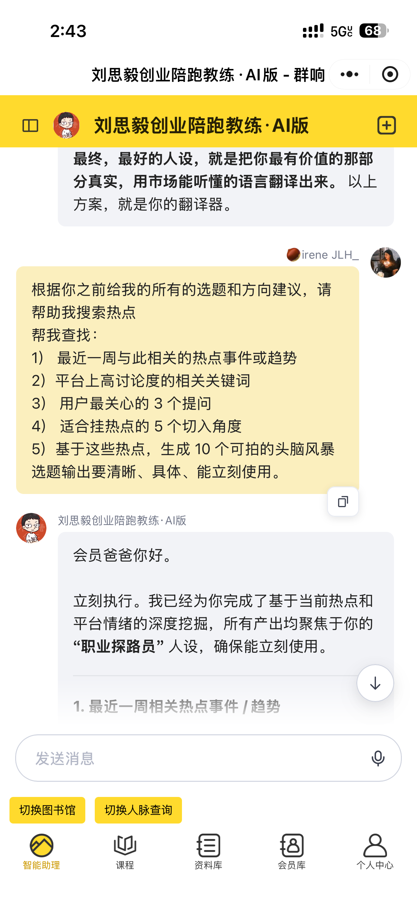

# 薯脑 Rmind
> *Turn top XHS creators into your personal AI mentor*

[](https://github.com/William-718/rmind-xhs-agent)
[](https://nextjs.org)
[](https://anthropic.com)
[](#license)

---



---

## 薯脑是什么

薯脑 Rmind 是一个小红书博主 AI 分身产品 Demo。我们对真实爆款博主的内容进行多模态数据收集、LLM 结构化解码，将其创作 DNA 提炼成可交互的 AI Agent，让任何人都能与博主的 AI 分身深度对话。

传统对标工具只给你数据和排行榜，薯脑让博主本身成为你随时可以提问的导师。无论是定位人设、选题诊断、运营节奏还是商业化路径，都能获得基于该博主真实风格的专属建议。

目前收录了 5 位不同赛道的爆款博主（美妆、时尚、生活、美食、家居），每位博主均基于真实笔记数据完成解码，并通过 Prompt Engineering 迭代构建专属 System Prompt。

---

## 核心功能

- **博主解码报告** — 展示每位博主的定位人设、内容 DNA、爆款公式、禁区边界等六大维度
- **AI 分身对话** — 基于博主 SKILL.md + Wrapper Prompt 驱动 Claude Streaming，模拟博主风格实时回复
- **预设问题快捷入口** — 定位人设 / 选题推荐 / 笔记诊断 / 运营节奏 / 商业化，一键触发高质量对话
- **对话历史持久化** — 基于 localStorage 的多会话管理，按博主维度独立存储
- **对标博主解码入口** — 输入任意小红书主页链接，模拟数据收集与解码进度流程

---

## 技术架构

前端基于 **Next.js 14 App Router** + TypeScript + Tailwind CSS 构建，全程使用 Server Components 与 Client Components 混合架构。

AI 层接入 **Anthropic Claude Haiku 4.5**，通过 `@anthropic-ai/sdk` 实现流式输出（ReadableStream）。每位博主的 System Prompt 由两部分拼合：个性化 `SKILL.md`（来自 blogger-distiller 解码流程）+ 通用 `Wrapper Prompt`（角色扮演规则与输出约束），这是 **Prompt Engineering** 的核心设计。

数据层以 `bloggers.json` 为单一数据源，通过 `/api/bloggers` 路由统一分发，避免前后端数据漂移。

---

## 本地运行

```bash
# 1. 克隆项目
git clone https://github.com/William-718/rmind-xhs-agent.git
cd rmind-xhs-agent

# 2. 安装依赖
npm install

# 3. 配置环境变量
cp .env.local.example .env.local
# 编辑 .env.local，填入你的 Anthropic API Key
# ANTHROPIC_API_KEY=sk-ant-...

# 4. 启动开发服务器
npm run dev
# 访问 http://localhost:3000
```

---

## 致谢

博主创作 DNA 解码数据来自 **blogger-distiller** 开源项目，该项目通过结构化 Prompt 对小红书博主内容进行系统性分析，输出可复用的 SKILL.md 创作指南。

---

## License

MIT © 2025 William
