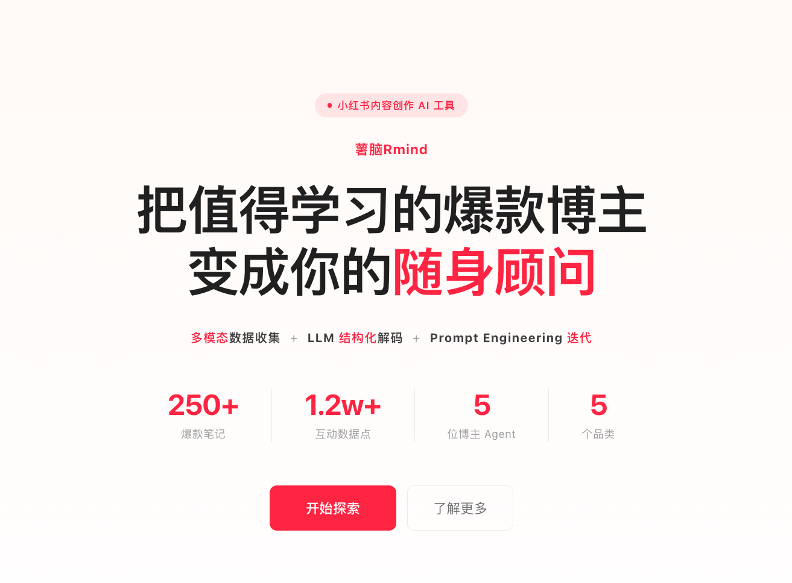

# 薯脑 Rmind
> *Turn top XHS creators into your personal AI mentor*

[](https://github.com/William-718/rmind-xhs-agent)
[](https://nextjs.org)
[](https://anthropic.com)
[](#license)

---
产品demo: rmindai.vercel.app


---

## 薯脑是什么

薯脑 Rmind 是一款面向小红书 KOC 的 AI Agent 产品。

刚起号的新手博主缺的不是数据和方法论，而是一位"24/7 在线的对标博主导师"。但真正能陪跑的头部博主，动辄收费数千，普通人难以企及。

薯脑的做法是：**把值得学习的爆款博主变成你的随身顾问**。产品通过多维度数据采集与 LLM 结构化解码，将博主的公开笔记蒸馏为一份结构化的"创作人格档案"，再通过 Prompt Engineering 迭代，将档案封装为一个可对话的对标博主 AI Agent。无论是**定位人设、选题推荐、笔记诊断、运营节奏，还是商业化路径**，都能获得基于该博主真实风格的专属建议。

---

## 为什么是薯脑

与传统数据工具最大的不同：

- **从"看数据"到"可对话"** — 传统对标工具只给你数据和排行榜，薯脑让博主本身成为你随时可以提问的导师
- **从"通用方法论"到"个性化建议"** — 爆款公式千篇一律，你的困境独一无二，薯脑基于你的真实情况给出专属建议
- **从"高价陪跑"到"零门槛体验"** — 过去只有付得起高价陪跑的博主能得到指导，现在每个新人都能拥有专属导师

---

## 核心功能

- **博主解码报告** — 展示每位博主的定位人设、核心认知、运营节奏、爆款公式、禁区边界等六大维度
- **AI Agent 对话** — 基于博主 SKILL.md + Wrapper Prompt 驱动 Claude Streaming，实时模拟博主风格回复
- **预设问题快捷入口** — 定位人设 / 选题推荐 / 笔记诊断 / 运营节奏 / 商业化，一键触发高质量对话
- **对话历史持久化** — 基于 localStorage 的多会话管理，按博主维度独立存储
- **自定义对标博主** — 输入任意小红书主页链接，系统模拟数据收集与 AI 分身构建流程

---

## 收录博主

目前收录 **5 位覆盖不同赛道的头部博主**，每位均基于真实笔记数据完成 AI 分身构建。博主筛选遵循四维标准：

| 维度 | 说明 |
|---|---|
| **粉丝量** | 保证博主影响力与方法论已被市场验证 |
| **数据表现** | 爆款率、互动率等指标符合"可学习"的稳定输出标准 |
| **变现能力** | 已跑通内容变现路径，对新手具备完整参考价值 |
| **可复制性** | 创作方法论可被新手吸收，而非仅靠个人天赋或特殊资源 |


---

## 技术架构

前端基于 **Next.js 14 App Router** + TypeScript + Tailwind CSS 构建，使用 Server Components 与 Client Components 混合架构。

AI 层接入 **Anthropic Claude Haiku 4.5**，通过 `@anthropic-ai/sdk` 实现流式输出（ReadableStream）。每位博主的 System Prompt 由两部分拼合：个性化 `SKILL.md`（来自 blogger-distiller 解码流程）+ 通用 `Wrapper Prompt`（角色扮演规则与输出约束），这是 **Prompt Engineering** 的核心设计。

数据层以 `bloggers.json` 为单一数据源，通过 `/api/bloggers` 路由统一分发，避免前后端数据漂移。

---

## 本地运行

```bash
# 1. 克隆项目
git clone https://github.com/William-718/rmind-xhs-agent.git
cd rmind-xhs-agent

# 2. 安装依赖
npm install

# 3. 配置环境变量
cp .env.local.example .env.local
# 编辑 .env.local，填入你的 Anthropic API Key
# ANTHROPIC_API_KEY=sk-ant-...

# 4. 启动开发服务器
npm run dev
# 访问 http://localhost:3000
```

---

## 致谢

博主创作 DNA 解码数据来自 **blogger-distiller** 开源项目，该项目通过结构化 Prompt 对小红书博主内容进行系统性分析，输出可复用的 SKILL.md 创作指南。

---

## License

MIT © 2025 William
